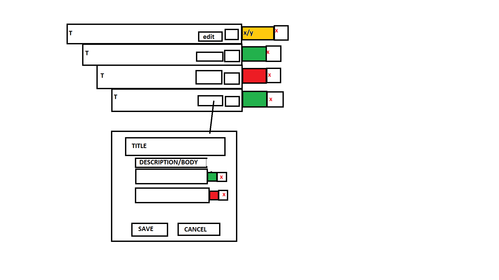

## Future Function Ideas
 - Gamify by granting XP on completion of objects
        -Creates need for xp bar, and account stats and stuff
- Add in global x/y completed
- Add in templates for [workouts, cooking, programming excersizes]
- Add in functionality to be able to move children around (Drag and drop? or just dropdown list then export child?)
- Add database triggers for INSERT on todo.todo_children and UPDATE ON todo.todo_children.completed 
        - to fill a column for x/y completed
- Progress bar
- use drop end button with items to choose between deleting or archiving todo

## More nesting perhaps?
- Proposal would be to refactor the todo_childrens body column to an array of grandchildren id's 

## Prod/Dev
 - use: process.env.NODE_ENV to figure out if were running a test build or prod build and based on that use different urls?

## Edge cases / Issues
- DELETE: if the user deletes all todo objects they cant create new ones (also cant create toos atm)